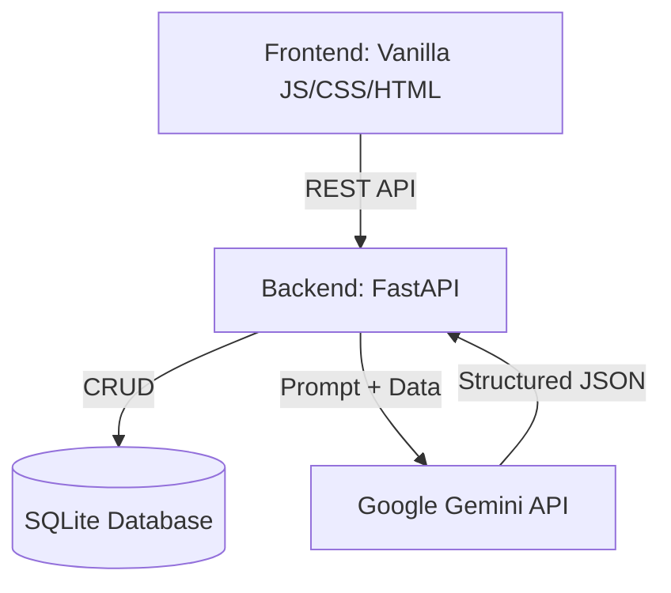

# TaskIQ: AI Project Manager

An intelligent project management tool that leverages Google's Gemini LLM to automatically convert unstructured meeting notes, emails, and chat logs into structured, actionable tasks. 

Built with an **AI Engineering-first** philosophy, this project emphasizes production-ready prompt engineering, structured LLM outputs, robust error handling, and intuitive frontend interactions.

---

## ✨ Standout Features

### 🧠 Advanced AI Engineering
- **Structured JSON Extraction**: Uses Gemini's `response_schema` bound to Pydantic models for 100% reliable data parsing (no brittle regex).
- **Chain of Thought (CoT)**: Forces the model to explicitly reason through prioritization and assignment *before* extracting data, dramatically reducing hallucinations.
- **Few-Shot Prompting**: Grounded prompt design with concrete examples for accurate edge-case handling.
- **Resilient Retry Logic**: Built-in exponential backoff via `tenacity` handles transient LLM API failures (e.g., rate limits, 502s) seamlessly.
- **AI Executive Summary**: Generates a holistic, natural-language status report of the entire project board using context from all active tasks.

### 💻 Enterprise-Grade Full Stack
- **Interactive Kanban Board**: Fully functional HTML5 drag-and-drop board. Dragging a task instantly syncs its status to the SQLite backend.
- **Strict Validation & Security**: Backend endpoints are strictly validated via FastAPI and Pydantic. SQLite queries are 100% parameterized to prevent SQL injection.
- **Testing Suite**: Includes an automated Pytest suite utilizing an in-memory database to ensure API reliability.
- **Professional UI/UX**: Custom CSS (no bloated frameworks) with an enterprise look-and-feel, Dark Mode support, and a responsive tabbed layout.
- **Data Portability**: Instantly export your filtered tasks to CSV.

---

## 🏗️ Architecture



---

## 🚀 Getting Started

### Prerequisites
- Python 3.9+
- A Google Gemini API Key

### 1. Installation
Clone the repository and set up a virtual environment:
```bash
git clone https://github.com/YourUsername/ai-project-manager.git
cd ai-project-manager

python -m venv venv
source venv/bin/activate  # On Windows use: .\venv\Scripts\activate
```

### 2. Install Dependencies
```bash
pip install -r requirements.txt
```

### 3. Configure Environment Variables
Copy `.env.example` to `.env` and add your Gemini API key:
```bash
cp .env.example .env
```
Open `.env` and paste your key: `GEMINI_API_KEY="your_actual_key"`

### 4. Run the Application
Start the FastAPI server:
```bash
uvicorn main:app --reload --port 8000
```
Open your browser and navigate to: [http://localhost:8000](http://localhost:8000)

---

## 🧪 Running Tests

This project includes a comprehensive suite of unit tests built with `pytest` and `fastapi.testclient`.

To execute the test suite, ensure your virtual environment is activated and run:
```bash
pytest
```

---

## 📁 Project Structure

```text
ai-project-manager/
├── main.py               # FastAPI application entry point
├── database.py           # SQLite persistence layer and CRUD operations
├── llm.py                # Google GenAI integration, schemas, and prompts
├── requirements.txt      # Python dependencies
├── routers/
│   └── tasks.py          # API endpoints for task management
├── static/
│   ├── index.html        # Main HTML structure and tabbed UI
│   ├── styles.css        # Custom styling and Kanban layout
│   └── app.js            # Frontend logic, drag-and-drop, API interactions
└── tests/
    └── test_main.py      # Automated test suite
```
